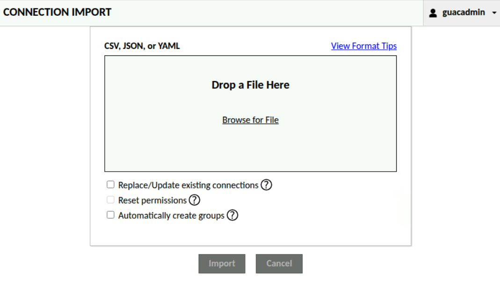

Importing connections from CSV, JSON, or YAML
=============================================

Administrators may batch import connections and connection groups from a file,
if the underlying authentication module supports dynamic connection/group creation.
To start a batch import, click the "Import" button on the connection edit tab.


At this point, the interface will accept a CSV, JSON, or YAML file containing
a list of connections to be imported.



Before importing, the following options are available:

* **Replace/Update existing connections** - If checked, connections in the
  import file that match the name and parent group of an existing connection
  will replace that connection. If unchecked, such conflicts are reported as
  errors.
* **Reset permissions** - If checked, permissions for connections in the
  import file are fully replaced with those specified in the file. If
  unchecked, existing permissions are preserved and any permissions listed in
  the file are added. This option is only available when
  "Replace/Update existing connections" is checked.
* **Automatically create groups** - If checked, any connection group paths
  referenced by a connection's `group` field that do not already exist will
  be created before the connections are imported, as will any users and user
  groups listed in the file that do not already exist. Multi-level paths such as
  `ROOT/Parent Group/Child Group` are created one level at a time, with each
  parent group created before its children. If unchecked, every `group` path,
  user, and user group referenced in the file must already exist; otherwise
  the affected connection is reported as an error and is not imported. Connection
  group paths are resolved only from the `group` field; a `parentIdentifier`
  must still refer to an existing connection group.

If group creation fails partway through an import, any groups that were
already created remain in place and the import is aborted. Re-importing the
same file is safe: existing groups are detected and skipped.

(batch-import-success)=
Success
-----------------

On success, the batch import UI will simply display a message indicating
how many connections were imported.


(batch-import-failure)=
Failure
-----------------

If import fails, the importer will display a list of the connections, along with
any relevant connection-specific errors, unless a file format error prevents
parsing the file into a list of connections at all.


(batch-import-file-format)=
Import file format
------------------

Three file types are supported for connection import: CSV, JSON, and YAML.
The same data may be specified by each file type. This must include the
connection name and protocol. Optionally, a connection group location, a list
of users and/or user groups to grant access, connection parameters, or connection
protocols may also be specified. Connection groups referenced by the `group`
field, and any users or user groups listed for access grants, must already
exist in the current data source unless "Automatically create groups" is
checked on the import screen. Note that any existing connection permissions
will not be removed for updated connections, unless "Reset permissions" is
checked.

This same file format information is available within the webapp, at the
"View Format Tips" link.

(batch-import-csv-format)=
### CSV Format

A connection import CSV file has one connection record per row. Each column will
specify a connection field. At minimum the connection name and protocol must be
specified.

The CSV header for each row specifies the connection field. The connection group
ID that the connection should be imported into may be directly specified with
"parentIdentifier", or the path to the parent group may be specified using "group"
as shown below. In most cases, there should be no conflict between fields, but if
needed, an " (attribute)" or " (parameter)" suffix may be added to disambiguate.
Lists of user or user group identifiers must be semicolon-separated. If present,
semicolons can be escaped with a backslash, e.g. "first\;last".

```
name,protocol,username,password,hostname,group,users,groups,guacd-encryption (attribute)
conn1,vnc,alice,pass1,conn1.web.com,ROOT,guac user 1;guac user 2,Connection 1 Users,none
conn2,rdp,bob,pass2,conn2.web.com,ROOT/Parent Group,guac user 1,,ssl
conn3,ssh,carol,pass3,conn3.web.com,ROOT/Parent Group/Child Group,guac user 2;guac user 3,,
conn4,kubernetes,,,,,,,
```

(batch-import-json-format)=
### JSON Format
A connection import JSON file is a list of connection objects. At minimum the connection
name and protocol must be specified in each connection object.

The connection group ID that the connection should be imported into may be directly
specified with a "parentIdentifier" field, or the path to the parent group may be
specified using a "group" field as shown below. An array of user and user group
identifiers to grant access to may be specified per connection.

```
[
  {
    "name": "conn1",
    "protocol": "vnc",
    "parameters": { "username": "alice", "password": "pass1", "hostname": "conn1.web.com" },
    "parentIdentifier": "ROOT",
    "users": [ "guac user 1", "guac user 2" ],
    "groups": [ "Connection 1 Users" ],
    "attributes": { "guacd-encryption": "none" }
  },
  {
    "name": "conn2",
    "protocol": "rdp",
    "parameters": { "username": "bob", "password": "pass2", "hostname": "conn2.web.com" },
    "group": "ROOT/Parent Group",
    "users": [ "guac user 1" ],
    "attributes": { "guacd-encryption": "none" }
  },
  {
    "name": "conn3",
    "protocol": "ssh",
    "parameters": { "username": "carol", "password": "pass3", "hostname": "conn3.web.com" },
    "group": "ROOT/Parent Group/Child Group",
    "users": [ "guac user 2", "guac user 3" ]
  },
  {
    "name": "conn4",
    "protocol": "kubernetes"
  }
]
```

(batch-import-yaml-format)=
### YAML Format

A connection import YAML file is a list of connection objects with exactly
the same structure as the JSON format.

```
---
  - name: conn1
    protocol: vnc
    parameters:
      username: alice
      password: pass1
      hostname: conn1.web.com
    group: ROOT
    users:
      - guac user 1
      - guac user 2
    groups:
    - Connection 1 Users
    attributes:
      guacd-encryption: none
  - name: conn2
    protocol: rdp
    parameters:
      username: bob
      password: pass2
      hostname: conn2.web.com
    group: ROOT/Parent Group
    users:
      - guac user 1
    attributes:
      guacd-encryption: none
  - name: conn3
    protocol: ssh
    parameters:
      username: carol
      password: pass3
      hostname: conn3.web.com
    group: ROOT/Parent Group/Child Group
    users:
      - guac user 2
      - guac user 3
  - name: conn4
    protocol: kubernetes
```

